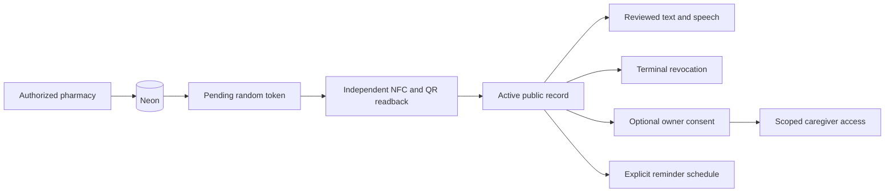

# MEDOT


A tactile NFC clip connects a medicine strip to an accessible, spoken digital record. MEDOT helps a person identify a labelled strip and find the medicine they selected.

**Stack:** Next.js 16.3.6, React 19.2.8, TypeScript, Neon Postgres, Clerk 7.9.10, ElevenLabs and Web Push. The source prototype remains preserved in the sibling `medot-base/medot-v0/web` checkout.

## Features

| Area | Implemented behavior |
| --- | --- |
| Pharmacy | Authorized sign-in, searchable catalog, custom medicine entry and review, NFC writing and matching QR, readback, activation and revocation |
| Medicine twin | Identity, printed batch/expiry, reviewed instructions, pairing verification and lifecycle timeline |
| Accessible reader | English/Bengali/Hindi controls, warning before identity, large controls, transcript, explicit online/device speech, Repeat/Stop and voice commands |
| Find my medicine | Confirm an exact medicine or recorded timing, scan candidates and receive match/mismatch feedback |
| Medication Detective | Collect up to five strips, explicitly finish, see all recorded matches and retap an exact selected strip |
| Caregiver sharing | Owner consent, scoped invitations, authenticated caregiver dashboard, optional manual identification check-ins and revocation |
| Reminders | Opt-in daily India-time schedules, generic lock-screen notifications, pause/delete and durable closed-app Web Push infrastructure |
| Visual theme | Shared light mint/forest colors, bundled Manrope and Bengali/Hindi Noto fonts, responsive patient and pharmacy pages |

MEDOT identifies a linked record. Pairing verification does not establish medicine authenticity. Identification check-ins do not establish dose taking. Opening, reading or scanning creates no caregiver event. Store only demo medicine information; no patient identifiers, invented doses or treatment recommendations.

## Setup

Use Node **24.18.1** and the committed lockfile. From the repository root:

```powershell
npm --prefix web ci --no-audit --no-fund
Copy-Item web/.env.example web/.env.local
```

Create the local environment file only if it does not already exist. Fill it privately using [the complete variable list](web/.env.example).

| Configuration | Required values |
| --- | --- |
| Database/origin | Demo Neon `DATABASE_URL` with TLS; `APP_ORIGIN=http://localhost:3000` locally, exact stable HTTPS origin deployed |
| Authentication | Matching Clerk publishable/secret keys; exact comma-separated `PHARMACY_ALLOWED_USER_IDS`; sign-in `/sign-in`, fallback `/pharmacy` |
| Speech | API key, `eleven_v3`, EN/BN voice IDs, optional HI voice ID; positive daily generation-attempt budget, default 100 |
| Sharing | Stable random `SHARING_RATE_LIMIT_SECRET` of at least 32 characters |
| Reminders | Matching P-256 VAPID public/private keys, HTTPS contact subject, distinct `REMINDER_CRON_SECRET` of at least 32 characters |
| Prepared demos | Optional homepage `DEMO_PUBLIC_TOKEN` and up to five `FIND_DEMO_TOKENS`, only after independent physical readback and activation |
| Operator tooling | Optional `RENDER_API_KEY`, actual HTTPS `RENDER_SERVICE_URL`, and `CRON_JOB_API_KEY`; never upload these API keys to the app |

From `web/`:

```powershell
node scripts/configure-reminders.mjs
npm run db:setup
npm run config:check -- --live
npm run dev
```

The reminder helper fills missing local keys without printing secrets. Database setup is atomic, additive and idempotent, preserving saved identities, instructions and tag states. Physical pack candidates remain blocked until their printed details are checked.

Public routes are `/m/[token]`, `/find`, `/detective`, `/sharing`, and `/reminders`; patients require no sign-in. The pharmacy portal is `/pharmacy`, with provisioning, tags and sharing subpages. Invited caregivers use `/caregiver`. Empty pharmacy authorization denies all accounts; a caregiver invitation grants no pharmacy authority.

## Architecture and privacy



Tokens are random 22-character values. NFC and QR encode the exact same canonical `/m/[token]` URL. Activation requires independent physical readback. Corrections issue a new token and revoke the old one. Printed `YYYY-MM` expiry is interpreted through month-end in Asia/Kolkata; expired labels warn before identity. Public speech accepts token/language and a fixed script selection, never arbitrary client text or voice IDs, and checks fresh state before playback.

Owner/invitation secrets travel in POST bodies, never URLs. Sharing consent expires after 30 days; check-ins are removed by scheduled cleanup after seven days. Reminder device consent expires after 90 days, with scheduled cleanup. The user explicitly chooses reminder time in India time; instructions are never interpreted as a schedule. Push contains no medicine name. Permission/delivery depend on browser, OS and connectivity, and may be delayed or missed. Supported iPhone/iPad Web Push requires Home Screen installation.

## Verification

Run sequentially from `web/`:

```powershell
npm test
npm run lint
npm run typecheck
npm run build
npm run release:smoke
npm run config:check -- --live
npm run speech:check -- --synthesize
npm run cues:check
```

The local production smoke owns port 3110, checks public/protected behavior, restarts its server and compares existing medicine/tag/audio persistence. Real account/device/provider evidence stays separate. Run all isolated database fixtures, including production HTTP owner consent/check-in/off, against the authorized **demo** database:

```powershell
$env:MEDOT_RELEASE_DEMO_DB='1'
try { npm run release:db } finally { Remove-Item Env:MEDOT_RELEASE_DEMO_DB }
```

This requires a built app and free port 3116. Tests clean their fictional fixtures, never activate a physical strip, and call no speech or push provider. Normal tests intentionally skip these opt-in database cases; run them separately for release. Logs stay in ignored `.superpowers/release/`.

Fixed cue approval data is committed in `web/src/data/interaction-prompts-review.json`, bound to exact script hashes. `npm run cues:generate` generates only reviewed scripts, consumes provider credits/daily budget, and reuses unchanged assets. Interface approval does not establish pack correctness or pronunciation.

## Hosting and free scheduled jobs

[render.yaml](render.yaml) configures a Node web service: root `web`, free instance, Singapore, manual deployments, build `npm ci --no-audit --no-fund && npm run build`, start `npm run start -- --hostname 0.0.0.0 --port $PORT`, liveness `/api/live`. `/api/health` checks the database. Set the actual HTTPS `APP_ORIGIN` and private app environment on Render; keep local origin local. Clerk publishable-key changes require a rebuild. Keep the same Neon database across deployments. [Render Next.js guide](https://render.com/docs/deploy-nextjs-app).

Use **free cron-job.org** instead of paid Render cron jobs. Create an account, verify email, and generate a key under Settings. Put `CRON_JOB_API_KEY` in ignored `web/.env.local`, plus the real `RENDER_SERVICE_URL`. After deploying the tested app:

```powershell
npm run jobs:configure
npm run jobs:configure -- --apply
```

The first command previews public job URLs without writing. The second creates or updates only matching MEDOT jobs, verifies configuration, and prints no credentials:

| Job | UTC schedule | HTTPS POST endpoint |
| --- | --- | --- |
| Reminder dispatch | Every minute | `/api/reminders/dispatch` |
| Sharing retention | Daily 00:00 | `/api/sharing/cleanup` |

Both require the private scheduler bearer header, never a secret in the URL; responses contain aggregate counts only. The scheduler gets no database credentials or medicine records. Response saving is disabled. Inspect execution history and failure/disabled status in its console. [Free service](https://cron-job.org/en/), [API setup](https://docs.cron-job.org/rest-api.html).

Dispatch claims up to five due occurrences atomically, rechecks record/consent, and sends once with a five-minute grace period/TTL. Failed delivery produces HTTP 503 and a failing CLI exit; claimed occurrences are not automatically retried. Queued push cannot be recalled. The free scheduler has a 30-second request timeout and scheduling is best effort; measure actual warm and cold delivery rather than promising exact alarms. [Scheduler limits](https://cron-job.org/en/faq/).

Sharing access enforces expiry immediately; the daily job deletes retained expired rows. Keep a compatible last healthy Render revision for rollback without dropping tables or changing the canonical origin. Recheck readiness, public/protected access, expiry and revoked states after deployment/rollback. Free Render can idle; measure cold/warm latency and warm it before judging. [Render limits](https://render.com/docs/free).

## Release status

All five feature phases plus UI/reminders are implemented locally. Remaining observed release gates are tracked honestly:

- ElevenLabs voice/model lookups succeed, but synthesis returned **402 payment_required** on 03 October 2026. Fix account entitlement before claiming online speech/cue assets ready; explicit supported device speech remains available.
- Deployment/redeployment, free scheduled-job execution and consenting phone notification delivery require actual results.
- Real allowed/outsider pharmacy and invited caregiver sessions, printed pack checks, two-tag NFC/QR equality, TalkBack, native 200% zoom and EN/BN pronunciation require account/device evidence.
- English/Bengali/Hindi interface copy is user approved. This does not approve clinical instructions or certify physical medicines.

Plans, internal evidence and session notes are preserved locally and excluded from Git. This README, app code, configuration, tests and fixed cue approval data remain reproducible from a clean checkout. Team names and license are omitted until supplied.
