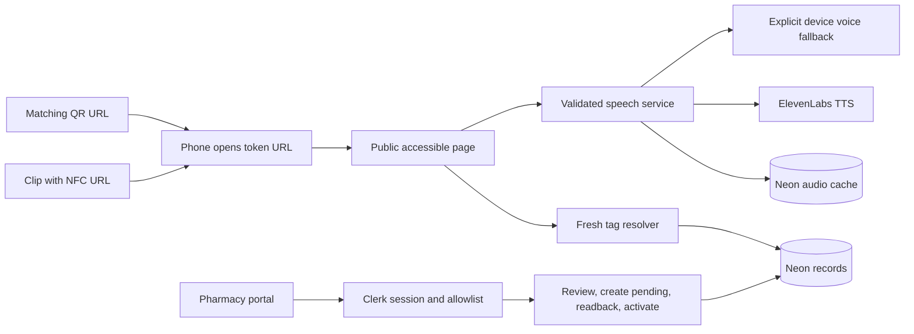

# Application architecture and contracts

All paths below are relative to the planned `web/` application. They are proposed paths until the import and implementation milestones run.

## Boundaries

Keep `src/lib/domain.ts` for validation/token/expiry, `provision.ts` for creation, `tag-lifecycle.ts` for transitions, and `tag-repository.ts` for SQL/resolution. UI components consume these services through server pages or route handlers. Keep parameterized Neon SQL. No additional Express service, ORM, or local database.

Create `src/lib/pharmacy-auth.ts` as the authorization boundary, `src/lib/i18n/` for dictionaries, `src/lib/speech/` for script/provider/cache services, and small components under `src/components/{brand,marketing,patient,pharmacy}/`. Preserve the existing provisioning form/writer tests as they evolve.

Device speech runs in the browser using a freshly validated record. The diagram's fallback edge describes the response to an unavailable provider; it does not send browser speech through the server.

## Routes

| Route | Access | Responsibility |
|---|---|---|
| `/` | Public | Landing page; `?lang=en/bn/hi` for localized content |
| `/m/[token]?lang=...` | Public | Resolve state and display patient record |
| `/sign-in/[[...sign-in]]` | Public | Clerk pharmacy sign-in, return to `/pharmacy` |
| `/pharmacy` | Authorized | Overview, actual tag counts, next actions |
| `/pharmacy/provision` | Authorized | Catalog and provisioning workflow |
| `/pharmacy/tags` | Authorized | Recover by token/URL, pending resume, revoke |
| `/admin`, `/admin/new`, `/admin/tags` | Redirect | Compatible links to new pharmacy routes |
| `/api/admin/medicines` | Authorized | Catalog; add brand/readiness fields |
| `/api/admin/tags` | Authorized POST | Validate and create pending token |
| `/api/admin/tags/[token]/activate` | Authorized POST | Pending-only activation after explicit verification |
| `/api/admin/tags/[token]/revoke` | Authorized POST | Revoke pending/active; no reactivation |
| `/api/public/tags/[token]` | Public GET | Fresh state/record response for refresh checks |
| `/api/public/tags/[token]/speech` | Public POST | `{language}` -> current validated audio |
| `/api/health` | Public GET | Preserve DB readiness result |
| `/api/live` | Public GET | Process liveness `{ok:true}` for Render |

Keep existing mutation URLs to minimize regression. Disable the old password login endpoint after Clerk cutover; return 410 rather than accepting an obsolete cookie. Return JSON 401 for unauthenticated API access and 403 for signed-in but unauthorized users; do not return an HTML sign-in redirect from APIs.

## Pharmacy authorization

Use `@clerk/nextjs` compatible with the pinned Next/React versions. Put `ClerkProvider` in `src/app/(operator)/layout.tsx` around pharmacy and sign-in routes. Root/patient layouts remain independent. `src/proxy.ts` initializes Clerk only for `/pharmacy(.*)`, `/sign-in(.*)`, and `/api/admin(.*)`. Read installed Next proxy docs before implementation.

`getPharmacyAccess(): Promise<PharmacyAccess>` returns `{kind:'authorized', userId}` or `{kind:'unauthenticated'}` or `{kind:'forbidden'}`. Call `await auth()` and compare its verified `userId` against `PHARMACY_ALLOWED_USER_IDS` from the server environment. Empty allowlist denies all. This is one shared demo pharmacy, not a multi-tenant platform; authorized teammates can operate its tags. Do not grant write permission to every person who signs up.

Check access in every pharmacy server page and every catalog/tag handler before SQL. Retain an origin helper for mutating requests, comparing the submitted Origin with validated `APP_ORIGIN` (localhost only in development). Do not trust a client-supplied pharmacy ID or role. Provider errors fail closed. The API authorization helper must be independently mockable for tests.

## Additive database migration

Retain existing medicine IDs and tags. Extend `scripts/setup-db.mjs` with idempotent `ALTER TABLE ... ADD COLUMN IF NOT EXISTS` and table creation. Existing rows remain valid. Never truncate tables or overwrite existing pack metadata to reseed a demo.

| Entity | Retained fields | Added fields |
|---|---|---|
| `medicines` | `id`, `generic_name`, `strength`, `dosage_form` | `brand_name text NULL`, `catalog_status text NOT NULL DEFAULT 'DEMO_READY'` |
| `tags` | Token, medicine FK, batch, expiry month, English `instruction`, lifecycle, timestamps | `instruction_bn text NULL`, `instruction_hi text NULL`, `created_by text NULL` |
| `tag_audio` | New | `token varchar(22)` FK, `language text`, `content_hash text`, `audio_base64 text`, `created_at timestamptz`; primary key `(token,language)` |
| `speech_budget` | New | `day date` primary key, `generation_count integer NOT NULL` |

Allowed catalog status: `DEMO_READY` or `PACK_CHECK_REQUIRED`. Demo-ready catalog labels can be used on explicitly fictional samples. Physical pack candidates with incomplete identities/strengths stay non-provisionable until seed metadata is checked in hand. Use a new medicine ID for corrected identity metadata once tags exist; the base joins tags to medicine rows, so changing that row could silently change old identities.

Audio language is `en/bn/hi`; cache stores only MP3 bytes encoded for SQL. Limit one audio object to 2 MiB decoded. The cache hash includes token, complete spoken script, effective language, configured voice ID/model, and script format version. It naturally changes for expiry warnings. Cache persistence is in Neon, not Render disk.

Reserve provider calls with an atomic SQL upsert/increment on today's Asia/Kolkata date, guarded by the configured daily maximum. Denied reservation makes no provider call. Failed calls consume a reservation too; this is an attempt budget. Bound cache-miss requests by token (15 requests/minute) and merge in-flight requests in the single service process. The durable daily cap is the final cross-process cost boundary.

## Domain/public interfaces

Preserve `generateToken()`, `buildTagUrl(token, origin)`, `expiryState(month, now?)`, `activateTag(token, repository)`, and `revokeTag(token, repository)` names. Extend creation compatibly to `createPendingTag(rawInput: unknown, repository: ProvisionRepository, origin: string, createdBy?: string): Promise<{token:string; url:string}>`; carry `createdBy` in `PendingTag` and map it to `created_by` in the insert. Authorized handlers always supply the verified user ID; legacy tests/calls may omit it.

Extend `ProvisionInput` with `instructionBn: string` and `instructionHi?: string`. English remains `instruction`; every supplied instruction trims to 1–500 characters. Medicine/batch limits stay 64 characters. Expiry stays `YYYY-MM`. New records require English and Bengali; Hindi is optional. Attach `created_by` from authorized server context, never request JSON.

Extend `PublicRecord` with `brandName?: string`, `instructionBn?: string`, `instructionHi?: string`. Preserve current English fields. `resolveTag()` still returns `active/pending/revoked/unknown`; service failures stay exceptions handled as unavailable. The fresh public route returns `{kind:'active', record, expiryState}` or a safe state without the record. Active legacy English-only records remain readable with an explicit missing-translation notice.

`normalizeLanguage(raw?: string | null): Language` accepts only `en/bn/hi` and defaults to `en`. `selectInstruction(record, requested): {text:string; language:Language; usedFallback:boolean}` selects reviewed text, otherwise English with an explicit notice. It never manufactures text.

`buildSpokenText(record, expired, language): string` evolves from the existing function and remains deterministic. `formatExpiryMonth(month, language): string` uses locale formatting. `getTagSpeech(token, requestedLanguage): Promise<SpeechResult>` composes resolver, script, quota/cache and provider. `SpeechResult` is `{kind:'audio', bytes:Uint8Array, language:Language, usedFallback:boolean}` or `{kind:'unavailable', reason:'unknown'|'pending'|'revoked'|'provider'|'budget'|'database'}`.

`synthesizeSpeech({text, language}): Promise<Uint8Array>` uses only server-controlled voice/model configuration. `getCachedAudio(token, language, contentHash)` and `putCachedAudio(...)` hide cache SQL. `reserveSpeechGeneration(now:Date): Promise<boolean>` owns the daily budget. Inject dependencies in service tests, following the existing repository-injection pattern.

## State and cache correctness

Tag creation is pending even if QR creation or NFC writing succeeds. The activation POST accepts `{verified:true}` only after UI readback confirmation. The server verifies pending state and required stored language fields; browser attestation is an operator check, not cryptographic proof of hardware readback. An NFC error leaves pending. Revocation is terminal; correcting or reusing a physical clip creates and writes a new token, followed by readback and activation.

Patient HTML, fresh public lookup and speech responses use `no-store`. Resolve the tag before accessing audio cache and recheck state before returning newly synthesized bytes. Every Read/Repeat revalidates current state; stop any old playback on language change, navigation or page hide. Refresh state on return to the foreground. Revocation cannot retroactively erase sound already heard, but it must prevent subsequent reads. Do not cache active-record status indefinitely or show cached medicine identity as a confirmed live result after a database failure.

Speech route: validate token/language/origin -> resolve active state -> select reviewed language -> build script with today's expiry warning -> cache -> budget reservation -> provider timeout -> state recheck -> cache/store -> response. Unknown 404, pending 409, revoked 410, provider/database/configuration 503, budget/rate limit 429. Return `audio/mpeg`, `Cache-Control: no-store`, and `X-MEDOT-Language`/`X-MEDOT-Language-Fallback` headers on success. Error bodies contain only a localized-safe reason code, never provider credentials or raw errors.

## Runtime and failure handling

Use Node.js 24.x initially. M1 verified and pinned Node 24.18.1 in `.node-version` and Render configuration, superseding the planning runtime snapshot. Do not major-upgrade the framework during the event. Build install uses the committed npm lockfile.

Render is the public HTTPS service; Neon remains the persistent data layer. Separate process liveness from DB readiness so a transient DB failure does not imply a broken process. Offline patient text explains inability to verify and offers retry/helper guidance. Full offline medicine caching is optional and must have a separate stale/revocation design before implementation.
